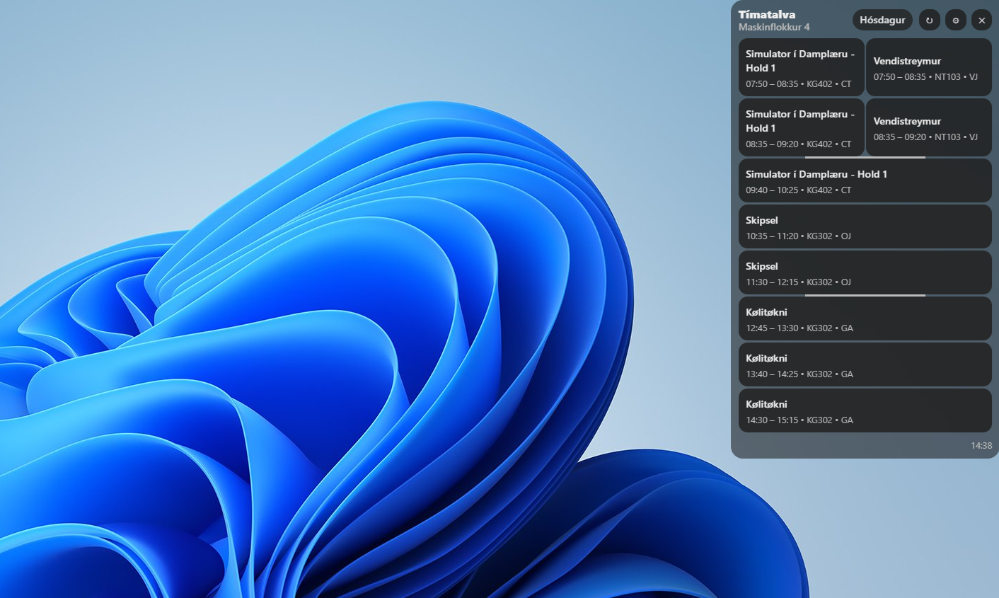
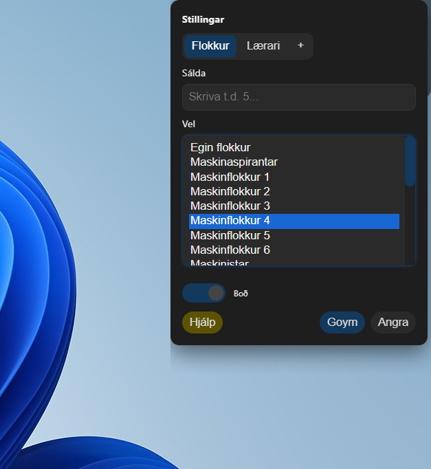

# Tímatalvan


> 🇫🇴 *Faroese version below.*  
> **Tímatalvan** is a small Electron program for viewing WebUntis schedules — built for students and teachers at the Faroese maritime school.
---
<br>

#### Google drive leinki til Tímatalvan.exe og uppsetanar vegleiðing er her &rarr; [Tímatalvan](https://drive.google.com/drive/folders/1woR5El6N9R-dJjr69zTJUhJhPGfaQ-sg?usp=drive_link)
<br>

## Tímatalvu forrit til webuntis tímatalvuna hjá Vinnuháskúlanum.


<p align="center">
  
</p>

---

**Tímatalvan** er eitt lítið forrit ment við Electron, ið vísir tímatalvuna frá [WebUntis](https://webuntis.com/). Forritið er gjørt til næmingar og lærarar á vinnuháskúlanum.

Endamálið við verkætlanini er at gera tað lættari og skjótari at síggja tímatalvuna, við hentum hentleikum sum:


-  **Áminning:** Fá boð 5 minuttir áðrenn ein tími byrjar.
-  **Egin tímatalva:** Tekur tú fak saman við fleiri flokkum? Tú kanst velja hvørji fak verða víst.
-  **Føroyskt mál og snið:** Bygt við føroyskum brúkarum í huga.


<p align="right">
  
</p>


## 📦 Hentleikar

-   **Skjótt:** Forritið goymir tímatalvuna lokalt (*caching*), so tað er skjótt at brúka, sjálvt um servarin hjá Untis er seinur.
-   **Fleiri fak:** Vís ymiskt fak frá fleiri flokkum á eini tímatalvu.
-   **Reint snið:** Einkul brúkaraflata, ið leggur dent á tað, ið hevur týdning.
-   **Ikki til ampa:** Forritið liggur í tínum *system tray* við síðuna av klokkuni, og er klárt við einum klikki.
-   **Boð:** Fá áminningar um komandi tímar og steðgir.
-   **Byrjar við innritan:** Tímatalvan byrjar av sær sjálvari, tá ið tú ritar inn - um tú velur tað.

<br>

Ynskir tú at fáa tímatalvuna á tína teldu, kanst tú gera tað her &rarr; [Tímatalvan](https://drive.google.com/drive/folders/1woR5El6N9R-dJjr69zTJUhJhPGfaQ-sg?usp=drive_link)
. Vegleiðing er eisini á sama stað.
<br>

** *Gevið gætur: forritið kann innihalda páskaregg* **

---

# Vilt tú betra um forritið, ella bara royna tað í terminalinum

### Kravdur útbúnaður
- [Node.js](https://nodejs.org/)
- npm

### Installatión
```bash
# Klona hetta repository'ið
git clone https://github.com/Timatalvan/Timatalvan.git

# Far inn í mappuna
cd Timatalvan

# Installera allar pakkarnar
npm install

# Koyr forritið
npm start
```

---

## 🛠 Menning

Høvuðslogikkurin í hesum forritinum:
- `src/main.js` - Handfer vindeygað, logikk fyri tekn, boð og goymslu.
- `src/untis.js`- Tekur sær av sambandinum millum tímatalvuna og webUntis heimasíðuna.
- `src/renderer.js` - Handfer brúkaraflatuna.
- `src/preload.cjs` - Brúgv millum Electron og brúkaraflatuna á ein tryggan hátt.

Ynskir tú at byggja forritið til ein installeringsfíl (`.exe`), kanst tú brúka hesa kommandoina:
```bash
npm run build
```
Installeringsfílurin verður stovnaður í `dist` mappuni.

---

## 🧾 Lisensur

Verkætlanin er útgivin undir **MIT Lisensinum**. Sí `LICENSE` fyri meira kunning.

---

## 🤝 Takk til

- WebUntis fyri at veita backend-tænastuna.
- Github og Gemini fyri hjálp við menningini.
- Næmingar og starvsfelagar fyri royndarkoyring og afturmelding.

---

## 🔐 Privatlivsfrágreiðing

Hetta forritið:
- Savnar ella sendir ikki brúkaradáta.
- Nýtir ikki nakað slag av analysu ella sporing.
- Fær ikki atgongd til staðseting, mikrofon ella kamera.

Allir upplýsingar um flokksval verða goymdir lokalt á tínari teldu.

---

## 💡 Vilt tú hjálpa?
Tú ert vælkomin at senda *pull requests* við betringum og nýggjum hentleikum.

---
#### Google drive leinki til Tímatalvan.exe og uppsetanar vegleiðing er her &rarr; [Tímatalvan](https://drive.google.com/drive/folders/1woR5El6N9R-dJjr69zTJUhJhPGfaQ-sg?usp=drive_link)

** *Gevið gætur: Forritið kann innihalda páskaregg* **
<br>

** *Tímatalvan hevur onki vinnuligt tílknýti til hvørki Vinnuháskúlan ella WebUntis* **

### Eystein 2025
